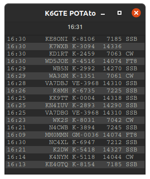

# potato

    

Pulls latest POTA spots. Displays them in a compact interface. If you have an instance of `flrig` running, when you click on a spot your radio will automatically tune to the spotted frequency and change modes to match the spot.   Filter output to band and or mode. If you double click on a spot(s), spots from that activator will be highlighted green, and be added to the clipboard. You can use this keep track of who you have worked. Activators can be toggled off again by double clicking the activator a second time.

 

- To filter for the actavators location, entering `US-WA` for example will show only the parks in US Washington State. To exclude `-US-WA` will exclude all parks in US Washington State. the presence of the first charcter `-` negates the patteren.

## Changes since 22.2.19 Instant Mashed

Added command line option to specify flrig server address:port.
To use a server not running on your local machine, launch it with either -s or --server, followed by the address and port separated by a colon.

Example: `potato -s 192.168.1.32:12345`

## Running from source

First install the requirements.

`python3 -m pip3 install -r requirements.txt`

Or if you're the Ubuntu/Debian type you can:

`sudo apt install python3-pyqt5 python3-requests python3-psutil`

Then, run the program from source.

`python3 potato.py`

## Building a binary executable

I've included a .spec file in case you wished to create your own binary from the source. To use it, first install pyinstaller.

`python3 -m pip3 install pyinstaller`

Then build the binary.

`pyinstaller -F potato.spec`

Look in the newly created dist directory to find your binary.

Or execute the install.sh shell script in the install_icon folder to copy the binary from the dist directory to your ~/.local/bin folder and install a launcher icon.
